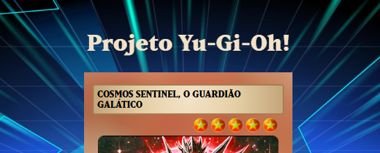
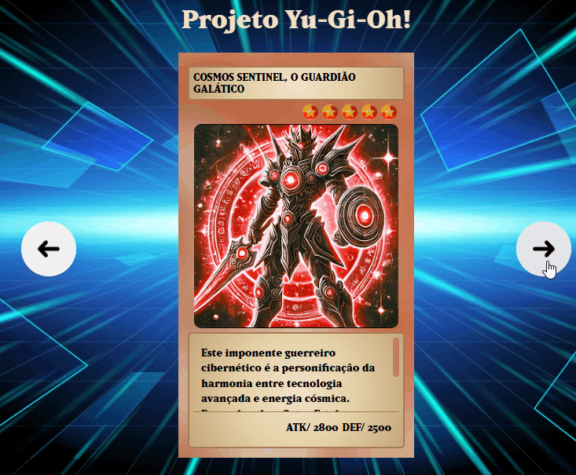

# Projeto Yu-Gi-Oh!

## Descrição

Projeto WEB que consiste em uma tela seletora de cartas de Yu-Gi-Oh!, popular jogo de cartas colecionáveis (TCG). Foram utilizadas as ferramentas HTML, CSS e JS para sua criação.

## Motivação

Faz parte dos meus estudos e curso Dev Em Dobro. 

## Aprendizado

Com o projeto, pude aprender a confecção de um produto WEB simples e prático.

### HTML

Aprendi sobre o escopo de um site, tendo "header", "body" e "footer", o uso de div e span, assim como toda a organização necessária para um clean code. Como resgatar recursos das pastas, e como 'linkar' os documentos CSS e JS em seu corpo.

### CSS

Aprendi a estilização de um site, fazendo um 'reset', um documento para tornar o produto responsivo. Aprendi como modificar a fonte padrão do site, assim como o uso do display flex, posições absolutas e relativas, entre outros conhecimentos básicos.

### JS

Conheci os conceitos de constante e chamada de fila, o querySelector, além da lógica por trás do JS nos usos de if.

## Prévia

### Por fim, agradeço o tempo para ler esse README e se interessar pelo projeto e meu Github. :D